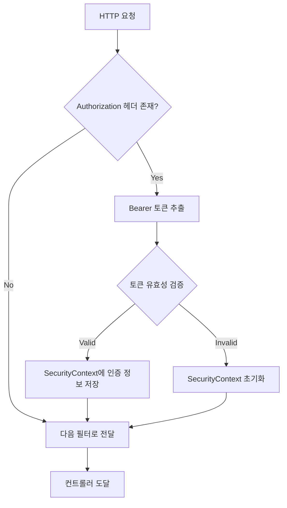

# Tigetting 프로젝트 - 인증/인가 및 에러 처리 설계 문서

## 📋 목차
1. [개요](#개요)
2. [에러 처리 시스템](#에러-처리-시스템)
3. [인증/인가 시스템](#인증인가-시스템)
4. [보안 설정](#보안-설정)
5. [주요 특징 및 장점](#주요-특징-및-장점)

---

## 개요

본 프로젝트는 **공연 티켓 예매 시스템(Tigetting)**으로, 보안과 안정성을 최우선으로 고려하여 설계되었습니다.
특히 **커스텀 에러 처리**와 **JWT 기반 인증/인가 시스템**에 많은 노력을 기울였습니다.

### 핵심 설계 철학
- ✅ **팀원 간 명확한 커뮤니케이션**: 에러 코드와 메시지를 체계화하여 한눈에 문제 파악 가능
- ✅ **사용자 친화적**: 명확하고 일관된 에러 메시지 제공
- ✅ **보안 강화**: JWT 기반 무상태(Stateless) 인증으로 확장성 확보
- ✅ **역할 기반 접근 제어**: 일반 사용자와 관리자 권한 분리

---

## 에러 처리 시스템

### 1. 에러 코드 체계 (`ErrorCode.java`)

프로젝트에서 발생할 수 있는 모든 에러를 **Enum**으로 정의하여 일관성 있게 관리합니다.

#### 구조
```java
public enum ErrorCode {
    ERROR_NAME(HttpStatus, "에러코드", "사용자 메시지");
}
```

#### 에러 분류

##### 🔐 인증/인가 관련 (AUTH_XXX)
| 에러 코드 | HTTP 상태 | 설명 |
|----------|----------|------|
| `AUTH_001` | 401 UNAUTHORIZED | 이메일 또는 비밀번호가 올바르지 않습니다 |
| `AUTH_002` | 403 FORBIDDEN | 관리자 권한이 필요합니다 |
| `AUTH_003` | 401 UNAUTHORIZED | 유효하지 않은 토큰입니다 |
| `AUTH_004` | 400 BAD_REQUEST | 이미 가입된 이메일입니다 |

##### 🎭 공연 관련 (PERFORMANCE_XXX)
| 에러 코드 | HTTP 상태 | 설명 |
|----------|----------|------|
| `PERFORMANCE_001` | 404 NOT_FOUND | 해당 공연을 찾을 수 없습니다 |
| `PERFORMANCE_002` | 400 BAD_REQUEST | 공연 생성에 실패했습니다 |
| `PERFORMANCE_003` | 400 BAD_REQUEST | 공연 업데이트에 실패했습니다 |
| `PERFORMANCE_004` | 400 BAD_REQUEST | 이미지 처리 중 오류가 발생했습니다 |
| `PERFORMANCE_005` | 404 NOT_FOUND | 포스터를 찾을 수 없습니다 |
| `PERFORMANCE_006` | 400 BAD_REQUEST | 공연 시작일은 종료일보다 앞서야 합니다 |
| `PERFORMANCE_007` | 400 BAD_REQUEST | 이미 종료된 공연입니다 |
| `PERFORMANCE_008` | 409 CONFLICT | 해당 시간대에 이미 등록된 공연이 있습니다 |

##### 👤 사용자 관련 (USER_XXX)
| 에러 코드 | HTTP 상태 | 설명 |
|----------|----------|------|
| `USER_001` | 400 BAD_REQUEST | 이메일 형식이 올바르지 않습니다 |
| `USER_002` | 400 BAD_REQUEST | 비밀번호는 8자 이상이어야 합니다 |
| `USER_003` | 400 BAD_REQUEST | 전화번호 형식이 올바르지 않습니다 |
| `USER_004` | 409 CONFLICT | 이미 탈퇴한 사용자입니다 |
| `USER_005` | 404 NOT_FOUND | 존재하지 않는 사용자입니다 |
| `USER_006` | 400 BAD_REQUEST | 비밀번호가 일치하지 않습니다 |
| `USER_007` | 400 BAD_REQUEST | 현재 비밀번호가 올바르지 않습니다 |
| `USER_008` | 403 FORBIDDEN | 본인만 수정할 수 있습니다 |

##### 🎫 예약 관련 (RESERVATION_XXX)
| 에러 코드 | HTTP 상태 | 설명 |
|----------|----------|------|
| `RESERVATION_001` | 404 NOT_FOUND | 예약 정보를 찾을 수 없습니다 |
| `RESERVATION_002` | 400 BAD_REQUEST | 이미 예약된 좌석입니다 |
| `RESERVATION_003` | 400 BAD_REQUEST | 예약 가능 시간이 아닙니다 |
| `RESERVATION_004` | 400 BAD_REQUEST | 최대 예약 가능 좌석 수를 초과했습니다 |
| `RESERVATION_005` | 409 CONFLICT | 이미 취소된 예약입니다 |
| `RESERVATION_006` | 400 BAD_REQUEST | 공연 시작 24시간 전에는 예약할 수 없습니다 |
| `RESERVATION_007` | 410 GONE | 예약 가능 기간이 종료되었습니다 |
| `RESERVATION_008` | 423 LOCKED | 다른 사용자가 좌석을 선택 중입니다 |

##### 💳 결제 관련 (PAYMENT_XXX)
| 에러 코드 | HTTP 상태 | 설명 |
|----------|----------|------|
| `PAYMENT_001` | 404 NOT_FOUND | 결제 정보를 찾을 수 없습니다 |
| `PAYMENT_002` | 400 BAD_REQUEST | 결제 금액이 일치하지 않습니다 |
| `PAYMENT_003` | 402 PAYMENT_REQUIRED | 결제 처리 중 오류가 발생했습니다 |
| `PAYMENT_004` | 409 CONFLICT | 이미 결제 완료된 주문입니다 |
| `PAYMENT_005` | 408 REQUEST_TIMEOUT | 결제 시간이 초과되었습니다 |
| `PAYMENT_006` | 400 BAD_REQUEST | 유효하지 않은 결제 수단입니다 |

##### 💰 환불 관련 (REFUND_XXX)
| 에러 코드 | HTTP 상태 | 설명 |
|----------|----------|------|
| `REFUND_001` | 404 NOT_FOUND | 환불 요청을 찾을 수 없습니다 |
| `REFUND_002` | 400 BAD_REQUEST | 환불 가능 기간이 지났습니다 |
| `REFUND_003` | 409 CONFLICT | 이미 환불 처리된 예약입니다 |
| `REFUND_004` | 400 BAD_REQUEST | 공연 시작 7일 전까지만 전액 환불 가능합니다 |
| `REFUND_005` | 400 BAD_REQUEST | 부분 환불만 가능한 예약입니다 |

##### 🏛️ 공연장 관련 (VENUE_XXX)
| 에러 코드 | HTTP 상태 | 설명 |
|----------|----------|------|
| `VENUE_001` | 404 NOT_FOUND | 공연장을 찾을 수 없습니다 |
| `VENUE_002` | 400 BAD_REQUEST | 공연장 좌석 정보가 올바르지 않습니다 |
| `VENUE_003` | 409 CONFLICT | 이미 등록된 공연장입니다 |
| `VENUE_004` | 400 BAD_REQUEST | 좌석 등급 설정이 잘못되었습니다 |

##### 💺 좌석 관련 (SEAT_XXX)
| 에러 코드 | HTTP 상태 | 설명 |
|----------|----------|------|
| `SEAT_001` | 404 NOT_FOUND | 좌석을 찾을 수 없습니다 |
| `SEAT_002` | 410 GONE | 이미 판매된 좌석입니다 |
| `SEAT_003` | 400 BAD_REQUEST | 선택할 수 없는 좌석입니다 |
| `SEAT_004` | 423 LOCKED | 좌석이 일시적으로 잠겨있습니다 |
| `SEAT_005` | 400 BAD_REQUEST | 좌석 번호 형식이 올바르지 않습니다 |

##### ⏰ 대기열 관련 (QUEUE_XXX)
| 에러 코드 | HTTP 상태 | 설명 |
|----------|----------|------|
| `QUEUE_001` | 404 NOT_FOUND | 대기열 토큰을 찾을 수 없습니다 |
| `QUEUE_002` | 410 GONE | 대기열 토큰이 만료되었습니다 |
| `QUEUE_003` | 429 TOO_MANY_REQUESTS | 대기 중입니다. 잠시 후 다시 시도해주세요 |
| `QUEUE_004` | 409 CONFLICT | 이미 대기열에 등록되어 있습니다 |
| `QUEUE_005` | 503 SERVICE_UNAVAILABLE | 현재 접속자가 많습니다. 대기열에 등록됩니다 |

##### 📧 이메일 관련 (EMAIL_XXX)
| 에러 코드 | HTTP 상태 | 설명 |
|----------|----------|------|
| `EMAIL_001` | 500 INTERNAL_SERVER_ERROR | 이메일 발송에 실패했습니다 |
| `EMAIL_002` | 400 BAD_REQUEST | 인증 코드가 일치하지 않습니다 |
| `EMAIL_003` | 410 GONE | 인증 코드가 만료되었습니다 |
| `EMAIL_004` | 429 TOO_MANY_REQUESTS | 이메일 발송 횟수를 초과했습니다 |

##### 📊 시스템 관련 (SYSTEM_XXX)
| 에러 코드 | HTTP 상태 | 설명 |
|----------|----------|------|
| `SYSTEM_001` | 503 SERVICE_UNAVAILABLE | 서비스 점검 중입니다 |
| `SYSTEM_002` | 500 INTERNAL_SERVER_ERROR | 데이터베이스 연결 오류가 발생했습니다 |
| `SYSTEM_003` | 507 INSUFFICIENT_STORAGE | 저장 공간이 부족합니다 |
| `SYSTEM_004` | 503 SERVICE_UNAVAILABLE | 외부 API 연동 오류가 발생했습니다 |

##### 🔧 공통 (COMMON_XXX)
| 에러 코드 | HTTP 상태 | 설명 |
|----------|----------|------|
| `COMMON_001` | 400 BAD_REQUEST | 잘못된 요청입니다 |
| `COMMON_002` | 400 BAD_REQUEST | 필수 파라미터가 누락되었습니다 |
| `COMMON_003` | 415 UNSUPPORTED_MEDIA_TYPE | 지원하지 않는 파일 형식입니다 |
| `COMMON_004` | 413 PAYLOAD_TOO_LARGE | 파일 크기가 너무 큽니다 (최대 10MB) |
| `COMMON_500` | 500 INTERNAL_SERVER_ERROR | 서버 오류가 발생했습니다 |

### 2. 에러 응답 형식 (`ErrorResponse.java`)

모든 에러는 일관된 JSON 형식으로 반환됩니다.

```json
{
  "code": "AUTH_001",
  "message": "이메일 또는 비밀번호가 올바르지 않습니다",
  "timestamp": "2025-01-26T10:30:45.123"
}
```

#### 응답 필드
- **code**: 에러 식별 코드 (팀원 간 소통 용이)
- **message**: 사용자에게 표시할 친화적인 메시지
- **timestamp**: 에러 발생 시각 (디버깅 및 로깅용)

### 3. 예외 클래스 계층 구조

```
RuntimeException
    └── BusinessException (비즈니스 로직 예외)
            ├── AuthException (인증/인가 예외)
            └── (기타 커스텀 예외 확장 가능)
```

#### BusinessException
- 모든 비즈니스 로직 예외의 부모 클래스
- ErrorCode를 포함하여 일관된 에러 처리 가능

#### AuthException
- 인증/인가 관련 특화 예외
- 기본값으로 `AUTH_FAILED` 사용

### 4. 글로벌 예외 핸들러 (`GlobalExceptionHandler.java`)

Spring의 `@RestControllerAdvice`를 활용하여 모든 예외를 중앙에서 처리합니다.

#### 처리 예외 유형

```java
@RestControllerAdvice
public class GlobalExceptionHandler {
    
    // 1. 비즈니스 예외 처리
    @ExceptionHandler(BusinessException.class)
    public ResponseEntity<ErrorResponse> handleBusinessException(BusinessException e)
    
    // 2. 잘못된 파라미터 검증 예외
    @ExceptionHandler(IllegalArgumentException.class)
    public ResponseEntity<ErrorResponse> handleIllegalArgumentException(...)
    
    // 3. 정적 리소스 요청 실패 (favicon.ico 등)
    @ExceptionHandler(NoHandlerFoundException.class)
    public ResponseEntity<Void> handleNoHandlerFoundException(...)
    
    // 4. 예상치 못한 모든 예외
    @ExceptionHandler(Exception.class)
    public ResponseEntity<ErrorResponse> handleException(Exception e)
}
```

#### 장점
- ✅ **중복 코드 제거**: 각 컨트롤러마다 try-catch 불필요
- ✅ **일관된 응답**: 모든 에러가 동일한 형식으로 반환
- ✅ **로깅 통합**: 모든 예외를 한 곳에서 로깅 가능
- ✅ **유지보수성**: 에러 처리 로직 변경 시 한 곳만 수정

---

## 인증/인가 시스템

### 1. JWT 기반 인증 구조

#### 🔑 JWT (JSON Web Token)
- **무상태(Stateless)**: 서버에 세션 저장 불필요, 확장성 우수
- **자가 포함(Self-contained)**: 토큰 자체에 사용자 정보 포함
- **서명 검증**: HS256 알고리즘으로 위변조 방지

#### JWT 구성 요소
```
Header.Payload.Signature
```
- **Header**: 토큰 타입 및 알고리즘 정보
- **Payload**: 사용자 식별자(subject), 발급/만료 시간
- **Signature**: 서버의 Secret Key로 생성된 서명

### 2. JWT 유틸리티 (`JwtUtil.java`)

JWT 토큰의 생성, 파싱, 검증을 담당하는 핵심 컴포넌트입니다.

#### 주요 기능

##### ✨ 토큰 생성
```java
public String generate(String username) {
    // 현재 시간 + 유효 기간(60분)
    return Jwts.builder()
        .setSubject(username)           // 사용자 이메일
        .setIssuedAt(now)                // 발급 시간
        .setExpiration(expiryDate)       // 만료 시간
        .signWith(getSigningKey(), HS256)
        .compact();
}
```

##### 🔍 토큰 검증
```java
public boolean validateToken(String token, String username) {
    // 1. 토큰에서 추출한 username과 요청 username 일치 확인
    // 2. 토큰 만료 여부 확인
    return username.equals(extractUsername(token)) && !isTokenExpired(token);
}
```

##### 🛡️ 예외 처리
- **ExpiredJwtException**: 만료된 토큰 → `AUTH_001` (AUTH_FAILED)
- **JwtException**: 유효하지 않은 토큰 → `AUTH_003` (TOKEN_INVALID)

#### 설정 값
```yaml
jwt:
  secret: "your-256-bit-secret-key"  # HS256용 충분한 길이 필요
  access-token-validity-ms: 3600000  # 60분
```

### 3. JWT 인증 필터 (`JwtAuthenticationFilter.java`)

모든 HTTP 요청을 가로채 JWT 토큰을 검증하는 필터입니다.

#### 동작 흐름



#### 코드 흐름
```java
@Override
protected void doFilterInternal(HttpServletRequest request, ...) {
    // 1. 중복 실행 방지
    if (request.getAttribute(ALREADY_FILTERED_ATTRIBUTE) != null) return;
    
    // 2. Authorization 헤더에서 토큰 추출
    String token = extractTokenFromHeader(authHeader);
    
    // 3. 토큰 검증 및 사용자 정보 로드
    String username = jwtUtil.extractUsername(token);
    UserDetails userDetails = userDetailsService.loadUserByUsername(username);
    
    // 4. SecurityContext에 인증 정보 설정
    if (jwtUtil.validateToken(token, username)) {
        UsernamePasswordAuthenticationToken authToken = 
            new UsernamePasswordAuthenticationToken(userDetails, null, authorities);
        SecurityContextHolder.getContext().setAuthentication(authToken);
    }
    
    // 5. 다음 필터로 전달
    filterChain.doFilter(request, response);
}
```

#### 특징
- ✅ **OncePerRequestFilter 상속**: 요청당 한 번만 실행 보장
- ✅ **중복 실행 방지**: `ALREADY_FILTERED_ATTRIBUTE`로 이중 체크
- ✅ **예외 안전성**: 토큰 검증 실패 시에도 다음 필터로 전달

### 4. 사용자 상세 정보 서비스 (`CustomUserDetailsService.java`)

Spring Security의 `UserDetailsService`를 구현하여 사용자 인증 정보를 제공합니다.

```java
@Override
public UserDetails loadUserByUsername(String username) {
    // 1. DB에서 사용자 조회
    UserEntity user = userMapper.findByEmail(username)
        .orElseThrow(() -> new UsernameNotFoundException("사용자를 찾을 수 없습니다"));
    
    // 2. Spring Security UserDetails로 변환
    return User.builder()
        .username(user.getEmail())
        .password(user.getPassword())  // BCrypt 해시값
        .authorities(List.of(new SimpleGrantedAuthority("ROLE_" + user.getRole().getName())))
        .build();
}
```

### 5. 예외 핸들러

#### 🚫 JwtAuthenticationEntryPoint
- **역할**: 인증되지 않은 사용자의 접근 처리
- **응답 코드**: 401 UNAUTHORIZED
- **응답 메시지**: "인증이 필요합니다" (AUTH_001)

```java
@Override
public void commence(HttpServletRequest request, 
                    HttpServletResponse response,
                    AuthenticationException authException) {
    response.setStatus(401);
    response.getWriter().write("""
        {
          "code": "AUTH_001",
          "message": "인증이 필요합니다",
          "timestamp": "%s"
        }
        """.formatted(LocalDateTime.now()));
}
```

#### 🔒 JwtAccessDeniedHandler
- **역할**: 권한이 없는 사용자의 접근 처리
- **응답 코드**: 403 FORBIDDEN
- **응답 메시지**: "관리자 권한이 필요합니다" (AUTH_002)

```java
@Override
public void handle(HttpServletRequest request,
                  HttpServletResponse response,
                  AccessDeniedException accessDeniedException) {
    response.setStatus(403);
    response.getWriter().write("""
        {
          "code": "AUTH_002",
          "message": "관리자 권한이 필요합니다",
          "timestamp": "%s"
        }
        """.formatted(LocalDateTime.now()));
}
```

---

## 보안 설정

### SecurityConfig.java

Spring Security의 전체 보안 정책을 정의합니다.

#### 1. 인증 제공자 설정

```java
@Bean
public DaoAuthenticationProvider authenticationProvider() {
    DaoAuthenticationProvider authProvider = new DaoAuthenticationProvider();
    authProvider.setUserDetailsService(userDetailsService);
    authProvider.setPasswordEncoder(passwordEncoder());  // BCrypt
    return authProvider;
}
```

#### 2. 비밀번호 암호화

```java
@Bean
public PasswordEncoder passwordEncoder() {
    return new BCryptPasswordEncoder();  // 단방향 해시 암호화
}
```

- **BCrypt 특징**:
  - 단방향 해시: 복호화 불가능
  - Salt 자동 생성: 동일 비밀번호도 다른 해시값
  - 적응형 해싱: 컴퓨팅 파워 증가에 대응

#### 3. CORS 설정

```java
@Bean
public CorsConfigurationSource corsConfigurationSource() {
    CorsConfiguration configuration = new CorsConfiguration();
    configuration.setAllowedOrigins(Arrays.asList(
        "http://localhost:5173",  // Vue.js 개발 서버
        "http://localhost:8080"   // Spring Boot 서버
    ));
    configuration.setAllowedMethods(Arrays.asList("GET", "POST", "PUT", "DELETE", "OPTIONS", "PATCH"));
    configuration.setAllowedHeaders(Arrays.asList("*"));
    configuration.setAllowCredentials(true);
    configuration.setMaxAge(3600L);
    
    UrlBasedCorsConfigurationSource source = new UrlBasedCorsConfigurationSource();
    source.registerCorsConfiguration("/**", configuration);
    return source;
}
```

#### 4. HTTP 보안 설정

```java
@Bean
public SecurityFilterChain filterChain(HttpSecurity http) {
    http
        .csrf(csrf -> csrf.disable())  // JWT 사용으로 불필요
        .cors(Customizer.withDefaults())
        .sessionManagement(session -> 
            session.sessionCreationPolicy(SessionCreationPolicy.STATELESS))  // 무상태
        
        .authorizeHttpRequests(authz -> authz
            // 공개 API
            .requestMatchers("/auth/**").permitAll()
            .requestMatchers("/performances/**").permitAll()
            .requestMatchers(HttpMethod.GET, "/api/venues/**").permitAll()
            
            // 관리자 전용
            .requestMatchers("/admin/api/**").hasRole("ADMIN")
            
            // 나머지는 인증 필요
            .anyRequest().authenticated()
        )
        
        // 예외 핸들러 등록
        .exceptionHandling(ex -> ex
            .authenticationEntryPoint(jwtAuthenticationEntryPoint)
            .accessDeniedHandler(jwtAccessDeniedHandler)
        );
    
    // JWT 필터 추가
    http.addFilterBefore(jwtAuthenticationFilter(), 
                        UsernamePasswordAuthenticationFilter.class);
    
    return http.build();
}
```

#### 접근 권한 매트릭스

| 엔드포인트 | 접근 권한 | 설명 |
|----------|----------|------|
| `/auth/**` | 모두 허용 | 로그인, 회원가입, 이메일 인증 |
| `/performances/**` | 모두 허용 | 공연 정보 조회 |
| `GET /api/venues/**` | 모두 허용 | 공연장 조회 (지도용) |
| `/admin/auth/login` | 모두 허용 | 관리자 로그인 |
| `/admin/api/**` | ADMIN 권한 필요 | 관리자 전용 API |
| `나머지 모든 요청` | 인증 필요 | 로그인한 사용자만 |

---

## 주요 특징 및 장점

### 1. 🎯 체계적인 에러 관리

#### 문제 상황
- 각 개발자가 임의로 에러 메시지 작성
- 동일한 에러에 대해 다른 메시지 반환
- 디버깅 시 에러 원인 파악 어려움

#### 우리의 해결책
```java
// ❌ 기존 방식
throw new RuntimeException("로그인 실패");
throw new Exception("인증 오류");

// ✅ 개선된 방식
throw new AuthException(ErrorCode.AUTH_FAILED);  // 팀원 모두가 이해
```

#### 장점
- ✅ **일관성**: 모든 에러가 동일한 형식
- ✅ **추적성**: 에러 코드로 발생 위치 즉시 파악
- ✅ **확장성**: 새로운 에러 타입 추가 용이
- ✅ **다국어 지원**: 추후 메시지만 변경하면 다국어 대응 가능

### 2. 🔐 강력한 보안 체계

#### JWT 무상태 인증
```
클라이언트 요청 → JWT 필터 → 토큰 검증 → SecurityContext 설정 → 컨트롤러
                      ↓ (실패)
                  인증 예외 핸들러 → 401/403 응답
```

#### 보안 강화 포인트
- ✅ **토큰 서명 검증**: HS256 알고리즘으로 위변조 방지
- ✅ **만료 시간 관리**: 60분 후 자동 만료
- ✅ **비밀번호 암호화**: BCrypt로 단방향 해시
- ✅ **역할 기반 접근 제어**: USER/ADMIN 권한 분리
- ✅ **CORS 설정**: 허용된 Origin만 접근 가능

### 3. 🚀 확장 가능한 아키텍처

#### 새로운 에러 타입 추가
```java
// 1. ErrorCode에 추가
RESERVATION_001(HttpStatus.BAD_REQUEST, "RESERVATION_001", "이미 예약된 좌석입니다")

// 2. 바로 사용 가능
throw new BusinessException(ErrorCode.RESERVATION_001);
```

#### 새로운 권한 추가
```java
// 1. Role 추가
enum Role { USER, ADMIN, MANAGER }

// 2. SecurityConfig에서 설정
.requestMatchers("/manager/**").hasRole("MANAGER")
```

### 4. 📊 개발자 친화적 설계

#### 디버깅 편의성
```json
// 프론트엔드 개발자가 받는 에러 응답
{
  "code": "PERFORMANCE_001",  // ← 백엔드 개발자에게 이 코드만 전달하면 됨
  "message": "해당 공연을 찾을 수 없습니다",
  "timestamp": "2025-01-26T10:30:45.123"
}
```

#### 로깅 통합
```java
@ExceptionHandler(Exception.class)
public ResponseEntity<ErrorResponse> handleException(Exception e) {
    log.error("Unhandled exception occurred: ", e);  // 모든 예외 로깅
    return ResponseEntity.status(500).body(new ErrorResponse(ErrorCode.INTERNAL_ERROR));
}
```

### 5. 🛡️ 다층 방어 전략

```
1차 방어: JWT 필터 → 토큰 유효성 검증
2차 방어: SecurityConfig → URL 패턴 기반 접근 제어
3차 방어: @PreAuthorize → 메서드 레벨 권한 검증
4차 방어: 비즈니스 로직 → ErrorCode 기반 예외 처리
```

---

## 사용 예시

### 1. 컨트롤러에서 에러 처리

```java
@PostMapping("/performances/{id}")
public PerformanceDto createPerformance(@PathVariable Long id, @RequestBody PerformanceDto dto) {
    // 공연 존재 여부 확인
    Performance performance = performanceRepository.findById(id)
        .orElseThrow(() -> new BusinessException(ErrorCode.PERFORMANCE_NOT_FOUND));
    
    // 권한 확인 (현재 사용자가 관리자인지)
    if (!isAdmin()) {
        throw new AuthException(ErrorCode.ADMIN_ACCESS_DENIED);
    }
    
    return performanceService.create(dto);
}
```

### 2. 프론트엔드에서 에러 처리

```javascript
// Vue.js 예시
async function fetchPerformance(id) {
  try {
    const response = await axios.get(`/performances/${id}`, {
      headers: {
        'Authorization': `Bearer ${token}`
      }
    });
    return response.data;
    
  } catch (error) {
    const errorCode = error.response.data.code;
    
    switch (errorCode) {
      case 'PERFORMANCE_001':
        alert('공연을 찾을 수 없습니다');
        break;
      case 'AUTH_001':
        alert('로그인이 필요합니다');
        router.push('/login');
        break;
      case 'AUTH_002':
        alert('관리자 권한이 필요합니다');
        break;
      default:
        alert('오류가 발생했습니다');
    }
  }
}
```

### 3. 로그인 흐름

```
1. 사용자: POST /auth/login { email, password }
2. AuthController: AuthService.login() 호출
3. AuthService: AuthenticationManager로 인증 시도
4. 성공 시: JWT 토큰 생성 및 반환
5. 실패 시: AuthException(AUTH_FAILED) 발생
6. GlobalExceptionHandler: 401 응답 + ErrorResponse 반환
```

---

## 향후 개선 방향

### 1. 토큰 블랙리스트
- 로그아웃 시 토큰 무효화 처리
- Redis를 활용한 블랙리스트 관리

### 2. Refresh Token 도입
- Access Token 만료 시 재발급 메커니즘
- 보안성과 사용자 경험 향상

### 3. 에러 코드 확장
- 예약 관련: RESERVATION_XXX (좌석 중복, 시간 제한, 잠금 등)
- 결제 관련: PAYMENT_XXX (금액 불일치, 결제 실패, 타임아웃 등)
- 환불 관련: REFUND_XXX (환불 기간, 부분 환불 등)
- 공연장 관련: VENUE_XXX (공연장 정보, 좌석 구조 등)
- 좌석 관련: SEAT_XXX (좌석 잠금, 판매 완료 등)
- 대기열 관련: QUEUE_XXX (토큰 관리, Rate Limiting 등)
- 이메일 관련: EMAIL_XXX (발송 실패, 인증 코드 등)
- 시스템 관련: SYSTEM_XXX (점검, DB 연결, API 연동 등)

### 4. 보안 강화
- Rate Limiting: 과도한 요청 방지
- IP 화이트리스트: 관리자 API 접근 제한
- 2FA (이중 인증): 관리자 계정 보호

### 5. 모니터링 및 알림
- 에러 발생률 모니터링
- 비정상 로그인 시도 알림
- 성능 메트릭 수집

---

## 결론

본 프로젝트는 **체계적인 에러 관리**와 **강력한 인증/인가 시스템**을 통해 다음을 달성했습니다:

1. ✅ **팀 협업 효율성 극대화**: 에러 코드만으로 즉시 소통 가능
2. ✅ **사용자 경험 향상**: 명확한 에러 메시지 제공
3. ✅ **보안 강화**: JWT 기반 무상태 인증으로 확장성 확보
4. ✅ **유지보수성**: 중앙 집중식 예외 처리로 관리 용이
5. ✅ **확장 가능성**: 새로운 기능 추가 시 기존 구조 재사용

> **"에러는 단순한 문제가 아니라, 시스템을 더 견고하게 만드는 기회입니다."**

---

## 참고 자료

- [Spring Security 공식 문서](https://spring.io/projects/spring-security)
- [JWT 공식 사이트](https://jwt.io/)
- [BCrypt 설명](https://en.wikipedia.org/wiki/Bcrypt)
- [REST API 에러 처리 모범 사례](https://www.baeldung.com/exception-handling-for-rest-with-spring)

---

**작성일**: 2025년 1월 26일  
**프로젝트**: Tigetting (공연 티켓 예매 시스템)  
**팀**: SSAFY Framework 10기

